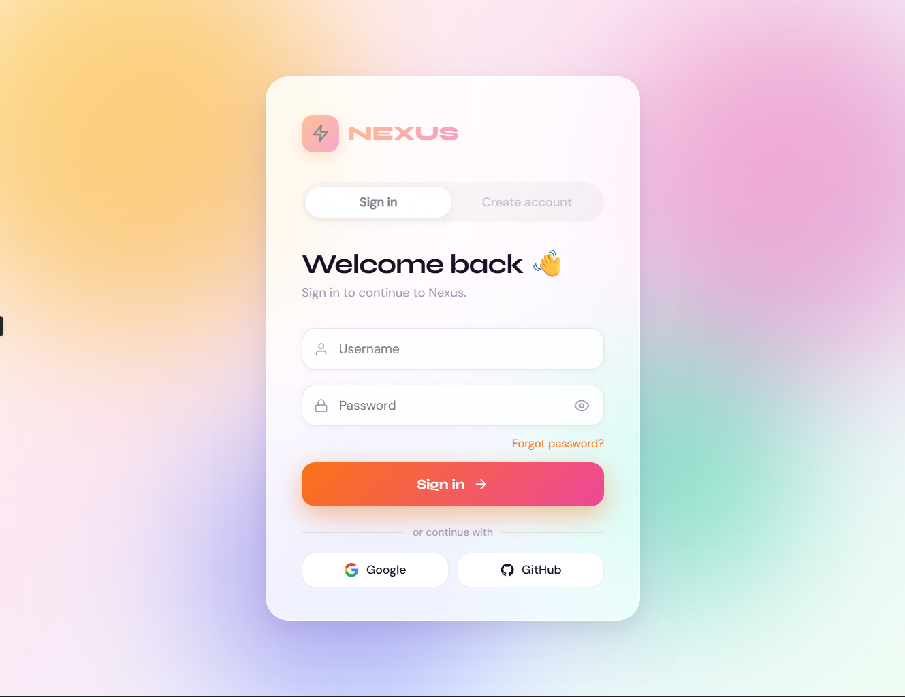
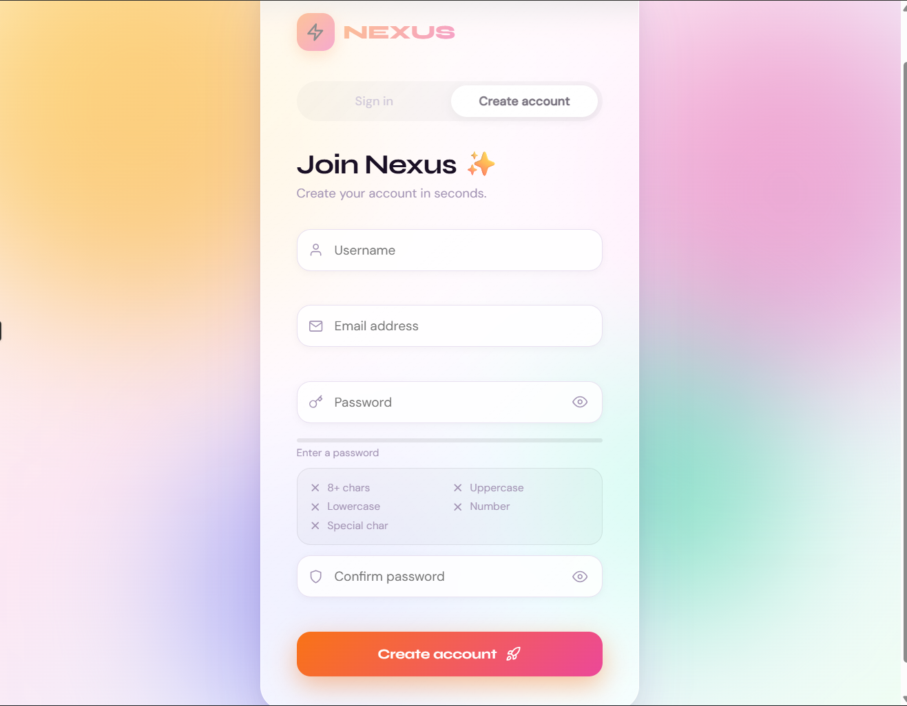

# 🔐 Login & Register Form

A modern **Login and Registration Form UI** built using **HTML, CSS, and JavaScript**.
This project demonstrates a clean authentication interface with smooth UI transitions and responsive design.

It can be used as a **frontend template for authentication pages** in web applications.

---

## 🚀 Live Demo

🌐 **View the Project Online**

https://sachin-deepak-s.github.io/login-register-form/

---

## 📸 Preview

### Login Page



### Register Page



> If preview images are not visible, make sure the file names inside the `images` folder match the names used above.

---

## ✨ Features

* Clean and modern UI design
* Login and registration forms
* Smooth form switching animation
* Responsive layout
* Simple and lightweight project
* Beginner-friendly code structure
* Easy to integrate with backend systems

---

## 🛠️ Technologies Used

* HTML5
* CSS3
* JavaScript

---

## 📂 Project Structure
```
login-register-form
│
├── index.html        # Main HTML file
├── style.css         # Styling for the form
├── script.js         # JavaScript logic for switching forms
├── images/           # Preview images
└── README.md         # Project documentation
```
---

## ⚙️ How to Run the Project

1. Clone the repository
```
git clone https://github.com/Sachin-deepak-S/login-register-form.git
```
2. Navigate into the project folder
```
cd login-register-form
```
3. Open the project

Open `index.html` in your browser.

---

## 💡 Future Improvements

* Add backend authentication (PHP / Node.js / Firebase)
* Add form validation
* Implement password strength indicator
* Add forgot password functionality
* Connect to database for storing users

---

## 🤝 Contributing

Contributions are welcome.

Steps to contribute:

1. Fork the repository
2. Create a new branch
3. Make improvements
4. Submit a pull request

---

## 👨‍💻 Author

**Sachin Deepak S**

GitHub
https://github.com/Sachin-deepak-S

Portfolio
https://sachin-deepak-s.netlify.app

---

## 📜 License

This project is open source and available under the **MIT License**.
